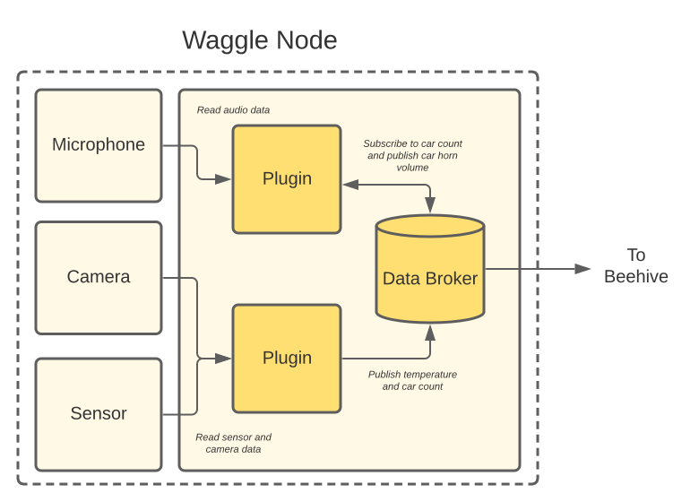

# Writing a plugin

In this guide, we'll walk through writing a basic plugin and exploring some of the functionality provided by pywaggle.

That being said, we do want to emphasize that pywaggle is designed to make it easy to interface _existing_ Python code with the [Waggle](https://github.com/waggle-sensor/waggle) stack. To a first approximation, pywaggle aims to augment print statements with publish statements.

If you'd like to jump ahead to real code, please see the following examples:
* [Minimal Numpy Example](https://github.com/waggle-sensor/plugin-numpy-example)
* [Hello World ML Example](https://github.com/waggle-sensor/plugin-helloworld-ml)

## What is a plugin?

A plugin is a self-contained program which typically reads sensors, audio or video data, does some processing and finally publishes results derived from that data.



The most basic example of a plugin is one which simply reads and publishes a value from a sensor. A more complex plugin could publish the number of cars seen in a video stream using a deep learning model.

## Basic example

_Note: In this guide, we currently only cover writing the plugin __code__. We still are updating the docs on building and running a plugin inside [Virtual Waggle](https://github.com/waggle-sensor/virtual-waggle) and natively. As such, this guide will help you structure and run your code locally but not against the rest of platform, yet._

We'll start by writing a plugin which simply publishes the value 123 as
measurement `my.sensor.name` every second.

```python
from waggle import plugin
from time import sleep

plugin.init()

while True:
    sleep(1)
    print("publishing a value!")
    plugin.publish("my.sensor.name", 123)
```

Let's walk through the pywaggle related details. First, we import the pywaggle plugin module:

```python
from waggle import plugin
```

Next, we initialize our plugin. This will prepare our plugin to interface with Waggle system services.

```python
plugin.init()
```

Finally, we add our publish statement. This will queue up our measurement name and value along with the current timestamp.

```python
plugin.publish("my.sensor.name", 123)
```

## More about the publish function

In the previous example, we saw the most basic usage of the publish function. Now, we want to talk about a couple additional features available to you.

First, metadata can be added to measurements to provide context to how a measurement was created. For example, suppose we had a left and a right facing camera on a node and wanted to track which one was used.

```python
plugin.publish("my.sensor.name", 123, meta={"camera": "left"})
```

This will bind the meta data together with the measurement and will be available throughout the rest of the data pipeline.

Second, you can explicitly provide a timestamp for situations where you have more information on when a measurement was taken. For example:

```python
plugin.publish("my.sensor.name", 123, timestamp=my_timestamp_in_ns)
```

_Note: Timestamps are expected to be in nanoseconds since epoch. In Python 3.7+, this is available through the standard time.time_ns() function._

## Subscribing to other measurements

Plugins can subscribe to measurements published by other plugins running on the same node. This allows users to leverage existing work or compose a larger application of multiple independent components.

The followng basic example simply waits for measurements named "my.sensor.name" and prints the value it received.

```python
from waggle.plugin import plugin
from random import random

plugin.init()
plugin.subscribe("my.sensor.name")

while True:
    msg = plugin.get()
    print("Another plugin published my.sensor.name value", msg.value)
```

In the case you need multiple multiple measurements, you can simply use:

```python
plugin.subscribe("my.sensor.name1", "my.sensor.name2", "my.sensor.name3")
```

To differentiate the results, you can use the message name:

```python
msg = plugin.get()
if msg.name == "my.sensor.name1":
    # do something
elif msg.name == "my.sensor.name2":
    # do something else
```

## More about the subscribe function

The subscribe function can match two kinds of wildcard patterns. Measurement names are treated as "segments" broken up by a dot and we can match various segments using the star and hash operators.

First, we can match a single wildcard segment using the "my.sensor.*" pattern. This will match all measurements with exactly three segments and whose first segment is "my", second segment is "sensor" and third segment can be anything.

Second, we can match zero or more segments using the "my.#" pattern. This will match all measurements whose first segment is "my" like "my.sensor", "my.sensor.name" or "my.sensor.name.is.cool".

## Accessing image data sources

_Warning: This may change as we integrate more data sources._

pywaggle provides an interface to access various data sources on the node. In this example, we'll look at how to get image from a camera.

```python
from waggle import plugin
from waggle.data import open_data_source
from time import sleep
import cv2

plugin.init()

with open_data_source("image_bottom") as cam:
    while True:
        sleep(60)
        timestamp, image = cam.get()
        cv2.imwrite("sample.jpg", image)
        plugin.upload_file("sample.jpg")
```

Similarly, if we need a video stream for applications like estimating traffic flow, we can request a video by changing the main loop to:

```python
# using video instead of image
with open_data_source("video_bottom") as cam:
    while True:
        timestamp, frame = cam.get()
        # process video frame
```

## Uploading data

Let's say we wanted to augment the previous example to upload a sample image every 5m. We can save
the image using OpenCV and use plugin.upload_file function as follows:

```python
from waggle import plugin
from waggle.data import open_data_source
from time import sleep
import cv2

plugin.init()

with open_data_source("image_bottom") as cam:
    while True:
        sleep(300)
        timestamp, image = cam.get()
        # 1. save image to sample.jpg
        cv2.imwrite("sample.jpg", image)
        # 2. queue up the image to be upload
        plugin.upload_file("sample.jpg")
```

## Seeing the internal details

If we run the basic example, the only thing we'll see is the message "publishing a value!" every second. If you need to see more details, pywaggle is designed to easily interface with Python's standard logging module. To enable debug logging, simply make the following additions:

```python
from waggle import plugin
from time import sleep

# 1. import standard logging module
import logging

# 2. enable debug logging
logging.basicConfig(level=logging.DEBUG)

plugin.init()

while True:
    sleep(1)
    print("publishing a value!")
    plugin.publish("my.sensor.name", 123)
```

You should see a lot of information like:

```text
DEBUG:waggle.plugin:starting plugin worker thread
DEBUG:waggle.plugin:connecting to rabbitmq broker at rabbitmq:5672 with username "plugin"
DEBUG:waggle.plugin:rabbitmq connection error: [Errno 8] nodename nor servname provided, or not known
publishing a value!
DEBUG:waggle.plugin:adding message to outgoing queue: Message(name='my.sensor.name', value=123, timestamp=1619628240863845000, meta={})
DEBUG:waggle.plugin:connecting to rabbitmq broker at rabbitmq:5672 with username "plugin"
DEBUG:waggle.plugin:rabbitmq connection error: [Errno 8] nodename nor servname provided, or not known
publishing a value!
```

The most important lines are:

```text
publishing a value!
DEBUG:waggle.plugin:adding message to outgoing queue: Message(name='my.sensor.name', value=123, timestamp=1619628240863845000, meta={})
```

These are telling us that our messages are being queued up in an outgoing queue to be shipped.

You'll also see a number of messages related to rabbitmq.

These are simply indicating the our plugin is waiting to connect to the Waggle ecosystem. This is normal when testing a standalone plugin without the rest of the Waggle stack. Plugins will simply queue up measurements in-memory until they exit.
