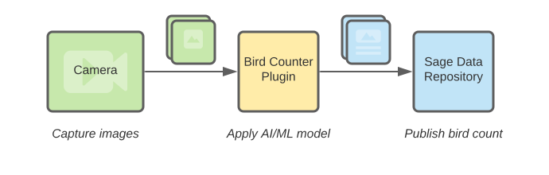
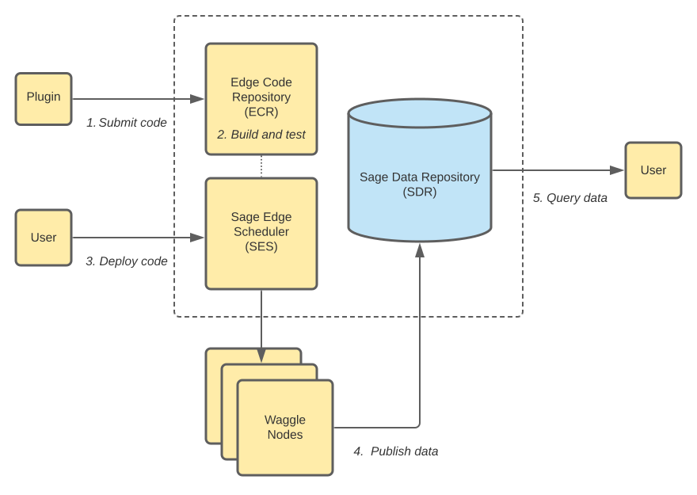

# Writing a plugin

In this guide, we'll walk through writing a basic plugin and exploring some of the functionality provided by pywaggle.

That being said, we do want to emphasize that pywaggle is designed to make it easy to interface _existing_ Python code with the [Waggle](https://github.com/waggle-sensor/waggle) stack. To a first approximation, pywaggle aims to augment print statements with publish statements.

If you'd like to jump ahead to real code, please see the following examples:

* [Minimal Numpy Example](https://github.com/waggle-sensor/plugin-numpy-example)
* [Hello World ML Example](https://github.com/waggle-sensor/plugin-helloworld-ml)

These repos can be used as starter templates for your own plugin development.

## What is a plugin?

A plugin is a self-contained program which typically reads sensors, audio or video data, does some processing and finally publishes results derived from that data.

The most basic example of a plugin is one which simply reads and publishes a value from a sensor. A more complex plugin could publish the number of cars seen in a video stream using a deep learning model.



Plugins fit into the wider Waggle infrastructure by being tracked in the Edge Code Repository, deployed to nodes and publishing data to our data repository.



## Writing "Hello World" plugin code

_Note: In this guide, we currently only cover writing the plugin __code__. We still are updating the docs on building and running a plugin inside [Virtual Waggle](https://github.com/waggle-sensor/virtual-waggle) and natively. As such, this guide will help you structure and run your code locally but not against the rest of platform._

We'll walk through writing a "hello world" plugin which simply publishes a increasing counter as
measurement `hello.world.counter` every second.

### 1. Install pywaggle

First, we'll install the latest version of pywaggle.

```sh
git clone https://github.com/waggle-sensor/pywaggle
pip install -U ./pywaggle[all]
```

This will install the core pywaggle modules along with the extra developer modules.

### 2. Create empty plugin directory

Create a new empty directory which we'll write our plugin in.

```sh
mkdir plugin-hello-world
cd plugin-hello-world
```

### 3. Create a requirements.txt dependency file

We'll create an empty `requirements.txt` file which we will use to track future dependencies.

```sh
touch requirements.txt
```

### 4. Create main.py file

Create a new file called `main.py` with the following code:

```python
from waggle import plugin
from time import sleep

plugin.init()

counter = 0

while True:
    sleep(1)
    print("publishing value", counter)
    plugin.publish("hello.world.counter", counter)
    counter += 1
```

Let's walk through the pywaggle related details. First, we import the pywaggle plugin module:

```python
from waggle import plugin
```

Next, we initialize our plugin. This will prepare our plugin to interface with Waggle system services.

```python
plugin.init()
```

Finally, we publish our counter value. This will queue up our measurement name and value along with the current timestamp and will eventually be shipped to our data repository where it can be accessed.

```python
plugin.publish("hello.world.counter", counter)
```

### 5. Run plugin

The plugin can now be run using:

```sh
python3 main.py
```

You should see the output:

```txt
publishing value 0
publishing value 1
publishing value 2
...
```

## Adding "Hello World" plugin packaging info

Now that we have the basic plugin code working, let's prepare this code to be submitted to the [Edge Code Repository](https://portal.sagecontinuum.org/apps/explore).

### 1. Create a Github repo for plugin

First, we need to create a Github repo for our plugin. Go ahead a create one called "plugin-hello-world" and add the contents from our plugin-hello-world directory.

For the purposes of this example, we'll assume our plugin URL is `https://github.com/username/plugin-hello-world`.

### 2. Add Dockerfile

Create and add a new file called `Dockerfile` with the following contents:

```dockerfile
FROM waggle/plugin-base:1.1.1-ml
COPY requirements.txt /app/
RUN pip3 install --no-cache-dir --upgrade -r /app/requirements.txt
COPY . /app/
WORKDIR /app
ENTRYPOINT ["python3", "/app/main.py"]
```

This file defines what base image should be used by a plugin and how it should be run. In more complex examples, additional dependencies may be specified here.

### 3. Add sage.yaml

Create and add a new file called `sage.yaml` with the following contents:

```yaml
name: "hello-world"
description: "My hello world plugin"
version: "0.0.1"
keywords: "hello, testing"
authors: "Your Name <your.email@somewhere.org>, A Coworker <your.coworker@somewhere.org>"
collaborators: "Helpful Collaborator <our.collaborator@otherplace.edu>"
funding: ""
license: ""
homepage: "https://github.com/username/plugin-hello-world/blob/main/README.md"
source:
  architectures:
    - "linux/amd64"
    - "linux/arm64"
    - "linux/arm/v7"
  url: "https://github.com/username/plugin-hello-world"
  branch: "main"
```

This file contains metadata about what your plugin is called, what it's supposed to do and where it lives. It is used by the [Edge Code Repository](https://portal.sagecontinuum.org/apps/explore) when submitting plugins.

### 4. Add ECR media

Create a `ecr-meta` directory and populate it with the following text and media:

1. `README.md` - Markdown providing a high level overview and landing page for your plugin.
2. `ecr-science-description.md` - Markdown with in depth description of the science being done here (1 page of text)
3. `ecr-icon.jpg` - An icon for the project/work 512x512px. 
4. `ecr-science-image.jpg` - A science image for the project with a minimum size of 1920x1080px.

## Beyond the basics

### More about the publish function

In the previous example, we saw the most basic usage of the publish function. Now, we want to talk about a couple additional features available to you.

First, metadata can be added to measurements to provide context to how a measurement was created. For example, suppose we had a left and a right facing camera on a node and wanted to track which one was used.

```python
plugin.publish("my.sensor.name", 123, meta={"camera": "left"})
```

This will bind the meta data together with the measurement and will be available throughout the rest of the data pipeline.

Second, you can explicitly provide a timestamp for situations where you have more information on when a measurement was taken. For example:

```python
plugin.publish("my.sensor.name", 123, timestamp=my_timestamp_in_ns)
```

_Note: Timestamps are expected to be in nanoseconds since epoch. In Python 3.7+, this is available through the standard time.time_ns() function._

### Subscribing to other measurements

Plugins can subscribe to measurements published by other plugins running on the same node. This allows users to leverage existing work or compose a larger application of multiple independent components.

The followng basic example simply waits for measurements named "my.sensor.name" and prints the value it received.

```python
from waggle.plugin import plugin
from random import random

plugin.init()
plugin.subscribe("my.sensor.name")

while True:
    msg = plugin.get()
    print("Another plugin published my.sensor.name value", msg.value)
```

In the case you need multiple multiple measurements, you can simply use:

```python
plugin.subscribe("my.sensor.name1", "my.sensor.name2", "my.sensor.name3")
```

To differentiate the results, you can use the message name:

```python
msg = plugin.get()
if msg.name == "my.sensor.name1":
    # do something
elif msg.name == "my.sensor.name2":
    # do something else
```

In more complex examples, the full message metadata can also be used to differentiate behavior:

```python
plugin.subscribe("env.temperature")

while True:
    msg = plugin.get()
    if msg.meta.get("sensor") == "bme280":
        # do something
    elif msg.meta.get("sensor") == "bme680":
        # do something else
```

### More about the subscribe function

The subscribe function can match two kinds of wildcard patterns. Measurement names are treated as "segments" broken up by a dot and we can match various segments using the star and hash operators.

First, we can match a single wildcard segment using the "my.sensor.*" pattern. This will match all measurements with exactly three segments and whose first segment is "my", second segment is "sensor" and third segment can be anything.

Second, we can match zero or more segments using the "my.#" pattern. This will match all measurements whose first segment is "my" like "my.sensor", "my.sensor.name" or "my.sensor.name.is.cool".

## Working with camera and microphone data

pywaggle provides a simple abstraction to cameras and microphones.

### Accessing a video stream

```python
from waggle import plugin
from waggle.data.vision import Camera
import time

plugin.init()

# open default local camera
camera = Camera()

# process samples from video stream
for sample in camera.stream():
    count = count_cars_in_image(sample.data)
    if count > 10:
        sample.save("cars.jpg")
        plugin.upload_file("cars.jpg")
```

The `camera.stream()` function provides a sequence of `ImageSample` items with the following properties:

* `sample.data`. captured image's `numpy` data array.
* `sample.timestamp`. captured image's timestamp.

Additionally, the Camera class accepts URLs and video files as input. For example:

```python
# open an mjpeg-over-http stream
camera = Camera("http://camera-server/profile1.mjpeg")

# open an rtsp stream
camera = Camera("rtsp://camera-server/v0.mp4")

# open a camera by device id (when plugin runs on a node)
camera = Camera("bottom_camera")
```

```python
from pathlib import Path

# open a prerecorded video file
camera = Camera(Path("my_cool_video.mp4"))
```

### Recording audio data

```python
from waggle import plugin
from waggle.data.audio import Microphone
import time

plugin.init()

microphone = Microphone()

# record and upload a 10s sample periodically
while True:
    sample = microphone.record(10)
    sample.save("sample.ogg")
    plugin.upload_file("sample.ogg")
    time.sleep(300)
```

Similar to `ImageSample`, `AudioSample` provide the following properties:

* `sample.data`. captured audio's `numpy` data array.
* `sample.timestamp`. captured audio's timestamp.
* `sample.samplerate`. captured audio's sample rate.

### AudioFolder and ImageFolder for testing

We provide a couple simple classes to provide audio and image data from a directory for testing.

In the following example, we assume we have directories:

```txt
audio_data/
    example1.ogg
    example2.ogg
    ...
image_data/
    img1.png
    cat-7.png
    example10.jpg
    ...
```

We can load up all the audio files in the `audio_data` folder for testing as follows:

```python
from waggle.data.audio import AudioFolder

dataset = AudioFolder("audio_data")

for sample in dataset:
    process_data(sample.data)
```

Similarly, we can do something similar for all the image files in the `image_data` folder.

```python
from waggle.data.vision import ImageFolder

dataset = ImageFolder("image_data")

for sample in dataset:
    process_image_frame(sample.data)
```

### Advanced: Choosing a color format

By default, the waggle.data.vision submodule uses an [RGB color format](https://en.wikipedia.org/wiki/RGB_color_model). If you need more control, you can specify one of `RGB` or `BGR` to both the `Camera` and `ImageFolder` objects as follows:

```python
from waggle.data.vision import Camera, ImageFolder, RGB, BGR

# use BGR data instead of RGB
camera = Camera(format=BGR)

# use BGR data instead of RGB
camera = ImageFolder(format=BGR)
```

## Seeing the internal details

If we run the basic example, the only thing we'll see is the message "publishing a value!" every second. If you need to see more details, pywaggle is designed to easily interface with Python's standard logging module. To enable debug logging, simply make the following additions:

```python
from waggle import plugin
from time import sleep

# 1. import standard logging module
import logging

# 2. enable debug logging
logging.basicConfig(level=logging.DEBUG)

plugin.init()

while True:
    sleep(1)
    print("publishing a value!")
    plugin.publish("my.sensor.name", 123)
```

You should see a lot of information like:

```text
DEBUG:waggle.plugin:starting plugin worker thread
DEBUG:waggle.plugin:connecting to rabbitmq broker at rabbitmq:5672 with username "plugin"
DEBUG:waggle.plugin:rabbitmq connection error: [Errno 8] nodename nor servname provided, or not known
publishing a value!
DEBUG:waggle.plugin:adding message to outgoing queue: Message(name='my.sensor.name', value=123, timestamp=1619628240863845000, meta={})
DEBUG:waggle.plugin:connecting to rabbitmq broker at rabbitmq:5672 with username "plugin"
DEBUG:waggle.plugin:rabbitmq connection error: [Errno 8] nodename nor servname provided, or not known
publishing a value!
```

The most important lines are:

```text
publishing a value!
DEBUG:waggle.plugin:adding message to outgoing queue: Message(name='my.sensor.name', value=123, timestamp=1619628240863845000, meta={})
```

These are telling us that our messages are being queued up in an outgoing queue to be shipped.

You'll also see a number of messages related to rabbitmq.

These are simply indicating the our plugin is waiting to connect to the Waggle ecosystem. This is normal when testing a standalone plugin without the rest of the Waggle stack. Plugins will simply queue up measurements in-memory until they exit.
